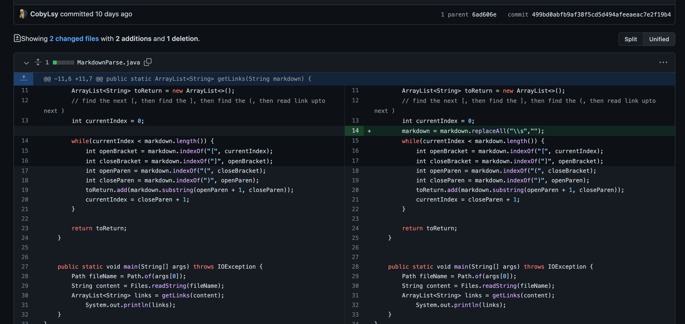
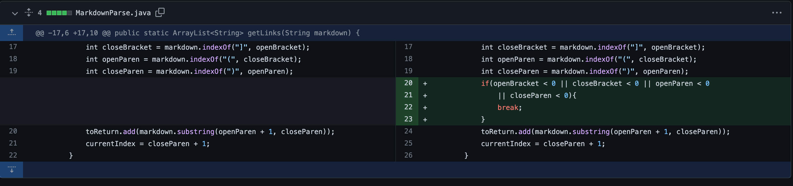
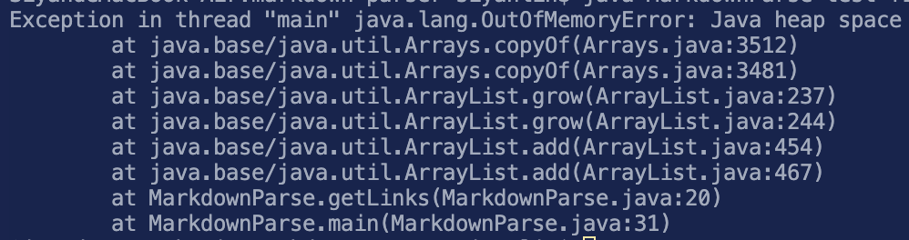
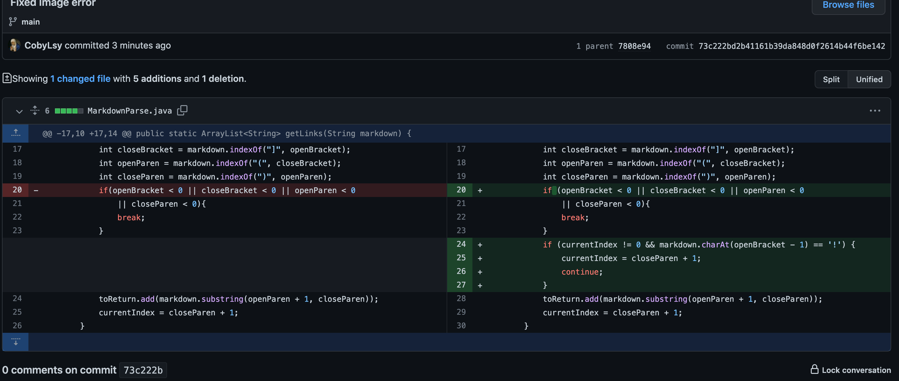
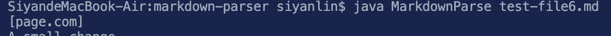

# Lab Report 2 - Week 3-4

> **Coby Lin**
>
> **B03 Group 4**

## First Attempt of Change:
* At first, my approach was to eliminate all the white spaces in the read-in string. So I added this line: 
* I made this change based on observing this [test file](https://github.com/CobyLsy/markdown-parser/blob/main/newtest.md?plain=1) created by myself. It contains multiple **blank lines** in between, before, or after texts, which is similar to the test file given.
* Because of the blank lines, the unmodified Markdownparse will run into this error when the test file is called: 
* The bug is caused by the MarkdownParse's file's lack of ability to collect only the useful texts (the texts of links that are not empty), as empty spaces in the test file take up the heap space too in the previous demonstration of running unmodified file. Therefore, any input files containing white lines fulled of white spaces would be a failur-inducing input. To address this, I added the new line shown in first picture to eliminate white spaces in the read-in string, and the program runs as expected for `test-file.md` and `newtest.md`.

## Second Change:
* Following my previous change, I noticed that my approach only fixed the situations where white spaces were around texts of links. When I run the edited java file on `test-file2` given by TAs, there's another out of memory/heap space error, presumably caused by the trailing non-link texts. 
* To address this issue, I learned from other groupmates on my group and added a break condition to the while loop:
* I noticed this error as I was going through the test files given by the TA in week 4, so I was late to fix this. Starting from [test-file2](https://github.com/CobyLsy/markdown-parser/blob/main/test-file2.md), I noticed that the out of memory error was coming back. What makes test-file2 different from previous test files was that it has a trailing line of texts (not forming a link with brackets and parenthesis), like this:
```
some paragraph text after the links
```
* The error output before the second modification of the file appeared to be rather the same, reasonably:

* The out of memory error for heap space is mainly caused by the indices within the while loop becoming an invalid value of **-1**, which then in turn led to an out of bound within the `toReturn` call, based on the range from `openParen` and `closeParen`. This **-1** value indicates that there's no links left in the file.This explained the need to provide the while loop an additional exit condition besides the`currentIndex < markdown.length` condition.

## Third Change:
* When proceeded to test-file6, I noticed that the texts given is formatted **as an image** in markdown. This image should **not** be printed in return, but my file ended up returning it.
* To stop **image texts** from being printed, I added a few lines to check if the bracket`[]`-parenthesis`()` link format starts with an exponential mark `!`:

* The bugged output from running [test-file6.md](https://github.com/CobyLsy/markdown-parser/blob/main/test-file6.md)before the fix is shown as follow:
. As shown, it printed out
```
[page.com]
```
* This shouldn't happen as the page.com is within the parenthesis of an image format in markdown. This error is understandable as the only difference between a link format and an image format in Markdown is the exponential mark `!` in front of the image format. This is why a simple check for the exponential mark would work.