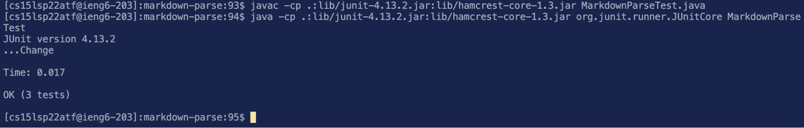

# Lab Report 3 - Week 5-6

>**Coby Lin**
>
>**B03 Group 4**

## Streamlining `ssh` Configuration
* Open `~/.ssh/config` on ssh server, and add these lines using `vim`:
```
Host ieng6
    HostName ieng6.ucsd.edu
    User cs15lsp22zzz (use your username)
```
* Side note: to exit the edit mode of `vim`, type `:wq`
* For reference of the first step, here is my `.ssh/config` file:

* After adding this, we can log in to our ssh account using the alias. In my case, I chose **ieng6** as the alias.
* Logging in `ssh` using the alias:

* Using `scp` with the alias, then logged in to `ssh` server to check the success of the transfer using `ls`:
 (note the ieng6 after filename, and before the directory name)
 (It's there!)

## Setup Github Access from ieng6
* In order to push and commit from the `ssh` server, we need to store our **public key** to the `ssh` account on **Github**. Personally, I followed [this instruction](https://docs.github.com/en/authentication/connecting-to-github-with-ssh/adding-a-new-ssh-key-to-your-github-account) to add the key to my github account.
* Here's where I stored my public key on Github's website:

* On local (my desktop), the private key to my user account is stored at:

* After storing the public key on github website, we also need to create a **personal access token** in order to push and commit on the remote ssh server, which is a relatively new regulation installed by github in recent years. I followed [this instruction](https://docs.github.com/en/authentication/keeping-your-account-and-data-secure/creating-a-personal-access-token) for this.
* After finishing setting up the personal access token, I can finally push and commit on the ssh server, as shown in this image: 
* Here is the [resulting commit](https://github.com/CobyLsy/cse15l-lab-reports/commit/5db7f8ad8e2e90d5747594ac4d8901b3864c86c7) on Github website. The commit message is enabled by the code after commit:
```
git commit -m "commit message"
```

## Copy whole directories with `scp -r`
* In order to copy the whole **markdown-parse directory** to the ieng6 account, we can utilize `scp -r`, following the account and the target directory on the server, as shown:    
* After copying the whole directory, I also checked the success of the copy using `ls` :
 (The directory and its content are all on the server!)
* To run the test on the remote server, we simply open the **markdown-parse directory** using `cd` and run it with **junit** command lines, as shown: 
* We can use semicolon ";" to separate different commands, in order to run them all in one line. Here is my command line that copies directory to ssh server, logs on to ther server, opens the directory, and runs the test: 
```
scp -r . cs15lsp22atf@ieng6.ucsd.edu:~/markdown-parse; ssh cs15lsp22atf@ieng6.ucsd.edu cd markdown-parse; javac -cp .:lib/junit-4.13.2.jar:lib/hamcrest-core-1.3.jar MarkdownParseTest.java; java -cp .:lib/junit-4.13.2.jar:lib/hamcrest-core-1.3.jar org.junit.runner.JUnitCore MarkdownParseTest
```
* Here is the screeshots of the result from running the previous command line:
 

