# Lab Report 4 - Week 7-8
> **Coby Lin**
>
> **B03 Group 4**

## Repository Links
* [Our Group](https://github.com/ujik500/markdown-parser)
* [The Reveiwed Group](https://github.com/rmccrystal/markdown-parser)

## Testing Snippet 1
### Expected Output
```
[`google.com, google.com, ucsd.edu]
```
### Make Corresponding Test
#### In Our Test File:
* Update `MarkdownParseTest.java`'s instance variables:
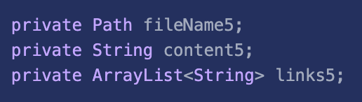
* Add these lines to **@Before SetUp** method to initiate these update variables:
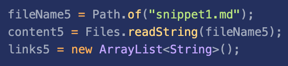
* Add a new test method for these variables:
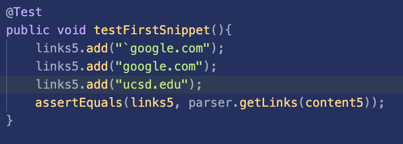
#### In Their Test File:
* Simply add this test method, as they have implemented their own `assertMarkdown` method to avoid setting up everytime a test runs.
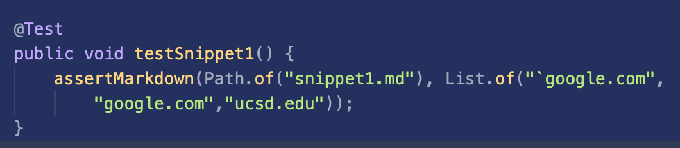
### Our Test Output
* It failed as expected, as we didn't think of ruling out the backsticks:
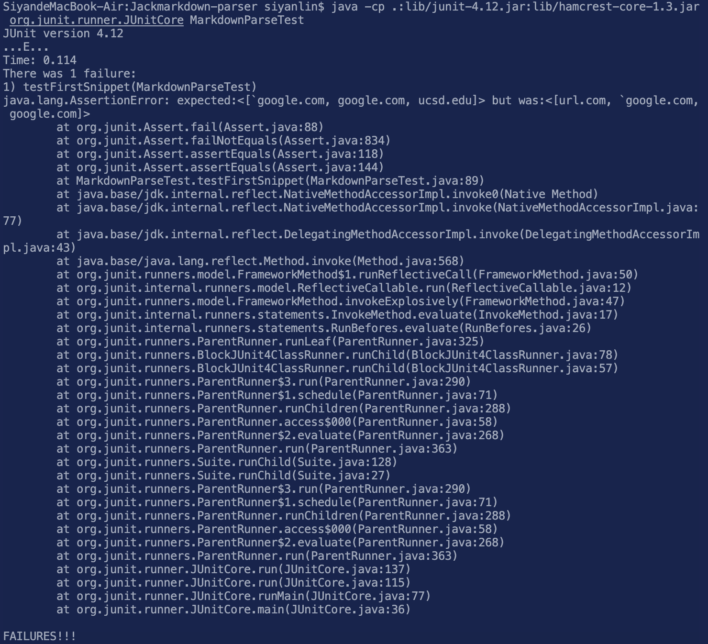
### Their Test Output
* It failed for the similar reason of the lack of consideration of backsticks:
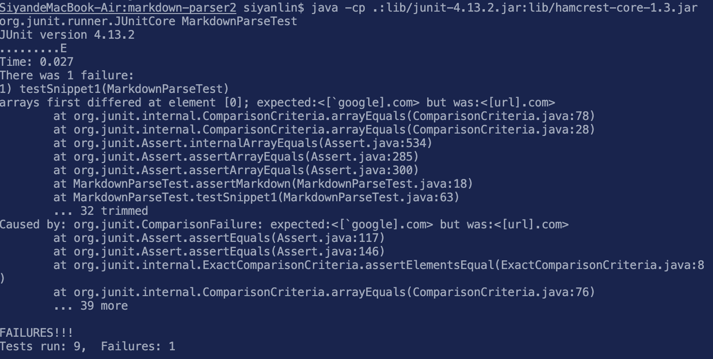

## Testing Snippet 2
### Expected Output
```
[a.com, a.com(()), example.com]
```
### Make Corresponding Test
#### In Our Test File:
* Update `MarkdownParseTest.java`'s instance variables:
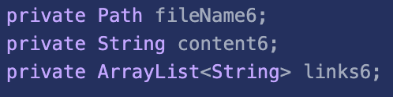
* Add these lines to **@Before SetUp** method to initiate these update variables:
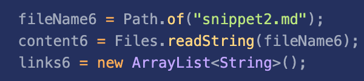
* Add a new test method for these variables:
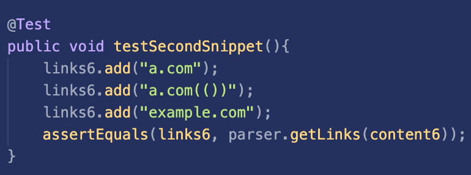
#### In Their Test File:
* Simply add this test method, as they have implemented their own `assertMarkdown` method to avoid setting up everytime a test runs.
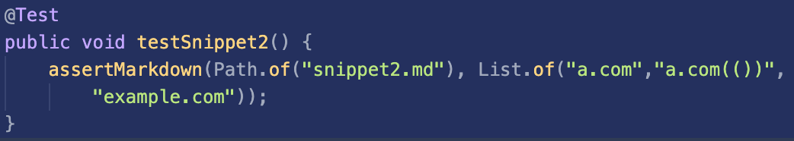
### Our Test Output
* It failed in reading the correct closing parenthesis for second link:
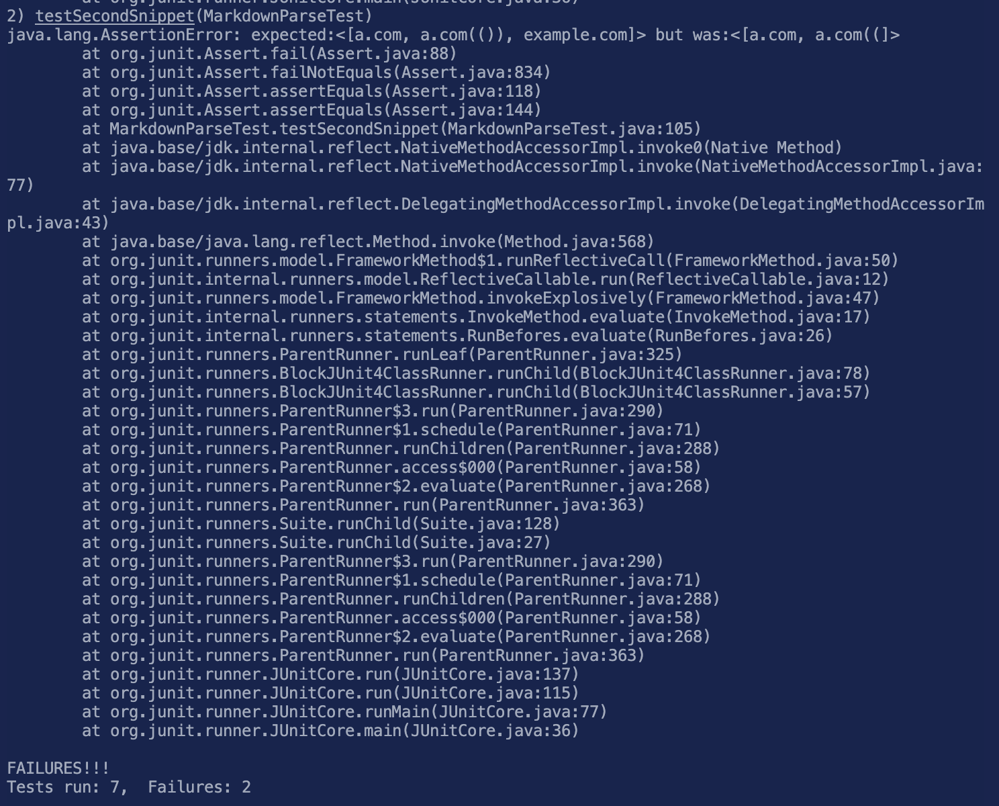
### Their Test Output
* It failed in a similar way to our program:
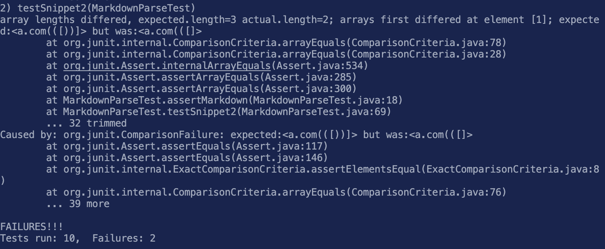

## Testing Snippet 3
### Expected Output
```
[https://www.twitter.com, https://sites.google.com/eng.ucsd.edu/cse-15l-spring-2022/schedule, https://cse.ucsd.edu/
]
```
### Make Corresponding Test
#### In Our Test File:
* Update `MarkdownParseTest.java`'s instance variables:
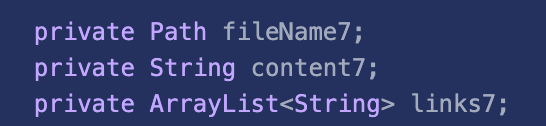
* Add these lines to **@Before SetUp** method to initiate these update variables:
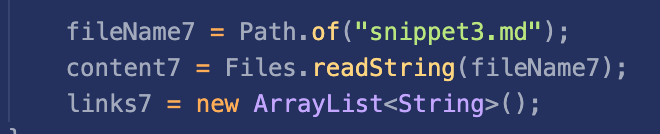
* Add a new test method for these variables:
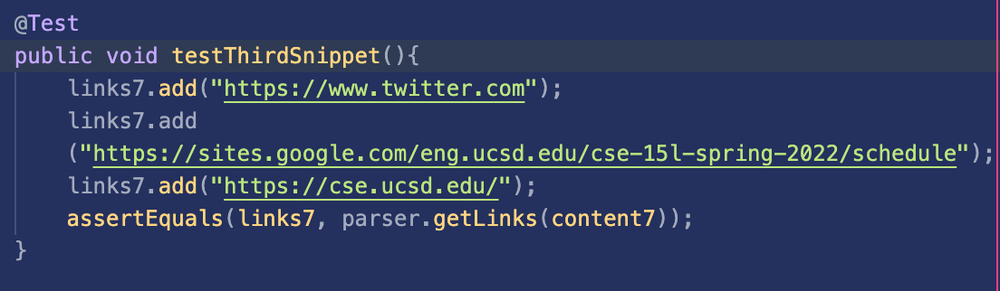
#### In Their Test File:
* Simply add this test method, as they have implemented their own `assertMarkdown` method to avoid setting up everytime a test runs:
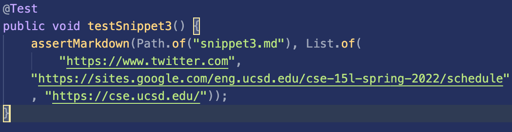
### Our Test Output
* It failed, as the link with no closing parenthesis wrongfully took the last link's closing parenthesis as its own:
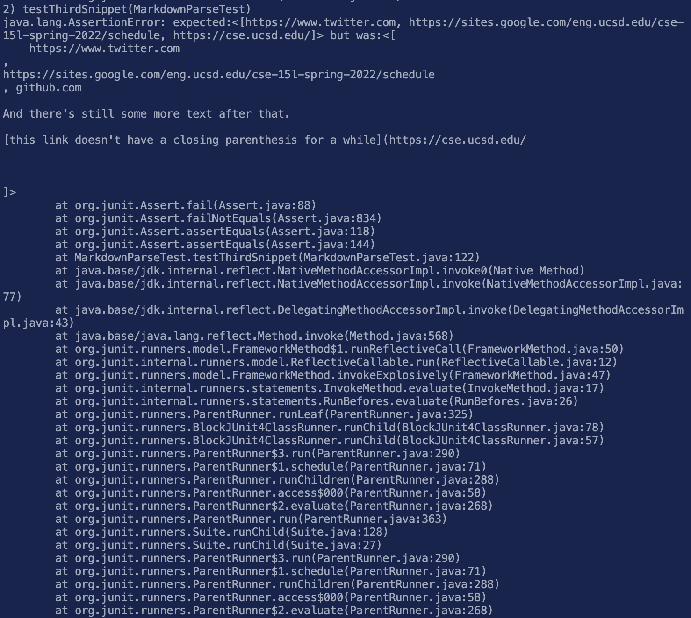
### Their Test Output
* It failed in a different way from ours: it failed to read any links, including the first one, presumably caused by the breaking title text of the first link:
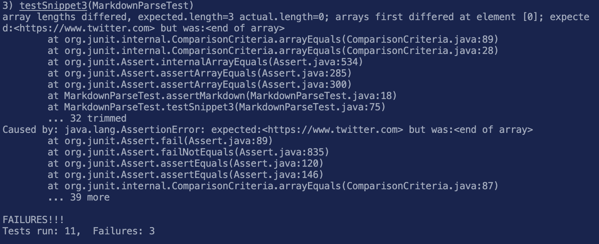

## Reflection Question of **Snippet1**
* There could definitely be a small code change that checks for the backsticks, especially the position of the first backstick-whether it's within valid pairs of brackets/parentheses or not. It is potentially short due to the already implemented part of the code regarding whether given brackets/parentheses are valid in creating links on markdown files.
## Reflection Question of **Snippet2**
* The closing parenthesis that's part of the website name is mistaken as the closing parenthesis of the link (the real closing parenthesis comes right after). In this case, we can create a stack structure to trace the parentheses and pop the opening parentheses that's matched with a non-link closing parentheses. It potentially can be contained within 10 lines of codes.
## Reflection Question of **Snippet3**
* I am uncertain about this one. I think of tracing the closing parenthesis back to the closest, valid opening parenthesis. At the same time, we also need to invalidate the bracket after a valid link opening parenthesi, to avoid problems associated with nested links caused by the first solution addressing the error causing problem of snippet3. Based these two directions on existing codes, there's a possibility that they can be contained within 10 lines.
