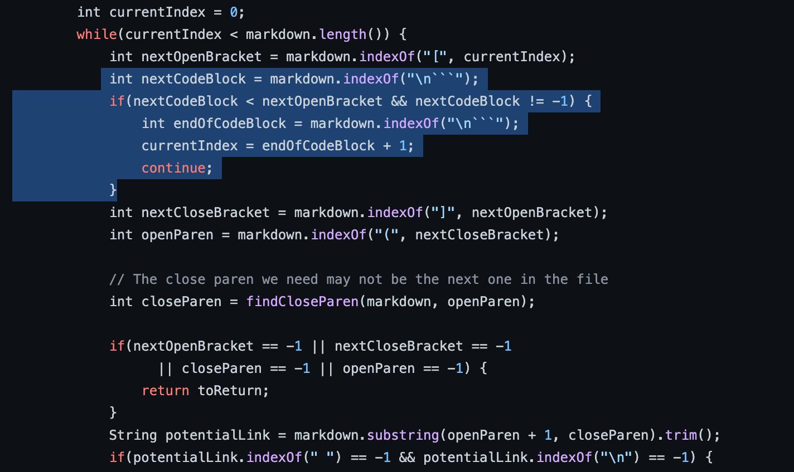

# Lab Report 5 Week 9-10
> **Coby Lin**
>
> **B03 Group 4**

## Using `vimdiff` to find the difference 
* After getting two `results.txt` files from running the textfile folder on my own `MarkdownParse.java` and the provided``MarkdownParse.java`, we can use `vimdiff` command on the two files to find the difference between them. Use the command:
```
vimdiff my-markdown-parser/results.txt
cse15lsp22-markdown-parser/results.txt
```
* My execution of this command (In my case, I upload the local results from running the provided file to the directory of the other results file, so I just name them differently and run them like this):
* After running `vimdiff`, we get this long list of comparison of the files' performance on each test:  As shown, difference in results will be marked in red, like `32.md`.
* Although I search through it manually, there could be faster approaches using vim-related shortcuts or programmatic approaches related to adding lines in `script.sh`.

## Links to the test files with Different Results
* [22.md](https://github.com/nidhidhamnani/markdown-parser/blob/main/test-files/22.md)
* [32.md](https://github.com/nidhidhamnani/markdown-parser/blob/main/test-files/32.md)
* [41.md](https://github.com/nidhidhamnani/markdown-parser/blob/main/test-files/41.md)

## Analysis for each test
### `22.md`
* The test file:
```
[foo](/bar\* "ti\*tle")
```
* In this test, I think my file (on the left) yielded the result
* 
* The problem with the code is that after trimming, there's still space in the middle of the link, therefore failing the if condition of `indexOf(" ") == -1`, as shown:
.On a side note, if the other special marks caused the link to be invalid, they can be excluded in similar ways as the **backsticks**.

### `32.md`
* The test file:
```
[foo](/f&ouml;&ouml; "f&ouml;&ouml;")
```
* In this case, I think my file (on the left) yielded the correct result.
* 
* As shown in the test file codes, I feel like it misbehaved in similar ways as the last test in difference. Here, I noticed another place where modification and addition of codes can be made: 
As mentioned before, the way the code avoids invalid closing parenthesis/brackets in block codes can be also used to avoid potential errors caused by other symbols.

### `41.md`
* The test file:
```
[a](url &quot;tit&quot;)
```
* 
* In this case, the provided file has the right answer, as no links would be expected in the output.
* At this point, I was very curious with all the three test cases, so I did a research online about the mechanism of **markdown**'s autolink: 
* Apparently, they parse the links or email links into this format to be clicked on and sent to :
* This explains why symbols like `&`, `""`, `/`, `=`, and `;` could potentially make a seemingly valid link invalid.
* That being said, this test case belongs in the same categories as the ones above, and similar fixes can be added after this region: 