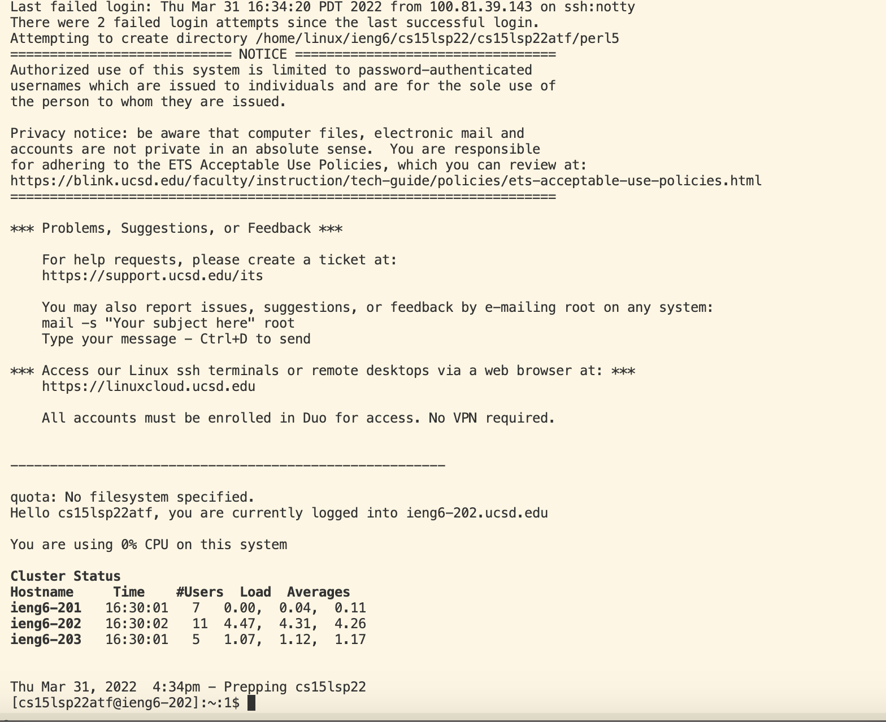

# Lab Report 1 - Week 1-2

> **Coby Lin**
>
> **B03 Group 4**

## Installing VSCode
* Go to the [Visual Studio Code](https://code.visualstudio.com/) Website.
* Click on the top right "download" button (circled in black), and choose the version corresponded to the operating system on your computer, as shown: 
* After you finish installing VSCode, you should be able to see a page like this when opening the application:  (note that the "Recent" files should be empty if you haven't worked on VSCode before, and that the theme/background color might be different)

## Remotely Connecting
* If you are a Window user, install OpenSSH before proceeding to the following steps: [Install Open SSH](https://docs.microsoft.com/en-us/windows-server/administration/openssh/openssh_install_firstuse)
* Look up your [course specific account](https://sdacs.ucsd.edu/~icc/index.php) for CSE 15L, which serves as your hostname for ssh
* Open terminal in VSCode, and type in `cs15lsp22zz@ieng6.ucsd.edu`, where `zz` is replaced by letters specific to your course specific account.
* After typing this, you will be prompted with messages like: 
```
The authenticity of host 'ieng6.ucsd.edu (128.54.70.227)' can't be established.

RSA key fingerprint is
SHA256:ksruYwhnYH+sySHnHAtLUHngrPEyZTDl/1x99wUQcec.

Are you sure you want to continue connecting?
(yes/no/[fingerprint])
```

* Seeing this message, you can simply type in "yes" and press enter. Then, if you type in your passwords for your course specific account correctly, your login to the server should be successful. Successful login should prompt you with messages like this:


## Try Some Commands
* After successfully logging in, you can try some commands, such as `cd`, `ls`, `pwd` , `cp` and `mkdir`. You should also try them in multiple ways with different additional commands after. For example, I tried ls, cp & cat:  note that my cp & cat commands received feedbacks like that because I haven't created a hello.txt file on local.

## Moving Files with `scp`
* create a java file on VSCode with a functioning main method, assuming its name is `file.java`.
* Open a new terminal on VSCode and type in 
```
scp file.java cs15lsp22zz@ieng6.ucsd.edu:~/
```
* The former scp command should prompt you for your password to the course-specific accound like before. After answering it correctly, the java file is on the server.
* You can check if it's on the server by logging on the server again with `ssh` command and then type in the `ls` command to list all files on the server. In my case, the file I transferred is called "HelloWorld.java", and it shows up when I typed in the `ls` command:
* after the java file is on the server, you can run `javac` and `java` on that file on the server too!

## Setting an SSH Key
* setting up the SSH key by utilizing the ssh-keygen command, and the key part for me was to type in the right file directory to save the key. An example of a set up;
```
# on client (your computer)
$ ssh-keygen
Generating public/private rsa key pair.
Enter file in which to save the key
(/Users/<user-name>/.ssh/id_rsa): /Users/<user-name>/.ssh/id_rsa
Enter passphrase (empty for no passphrase):
```
* It's worth noting that you can just press enter when a passphrase is asked to be set up, which would give your key no passphrase. I made a mistake and typed in a passphrase, now I have to type my passphrase everytime using the SSH key. 
* If you are a window user, follow the extra `ssh-add` steps [here](https://docs.microsoft.com/en-us/windows-server/administration/openssh/openssh_keymanagement#user-key-generation).
* To use the key, we also need to copy the public key stored on local from the keygen step earlier onto the `.ssh` directory of your user account on the server:
1. create the directory **on server** using ` mkdir .ssh`
2. **on client**, type 
```
scp /Users/<user-name>/.ssh/id_rsa.pub cs15lsp22zz@ieng6.ucsd.edu:~/.ssh/authorized_keys
```
3. After these two steps, you can ssh or scp from the client to the server without entering the password: (As I mentioned before, normally you don't need the passphrase either if you haven't set the passphrase in the first place. Mine demonstration shows the case when a passphrase is set up - no password is needed but a passphrase is needed)

## Optimizing Remote Running
Several tips listed below to make your experience easier:
1. type in command in quotes in the same line of an `ssh` command to directly run in on the remote server. e.g. 
```
$ ssh cs15lsp22zz@ieng6.ucsd.edu "ls"
```
2. Use semicolons inbetween multiple commands on the same line to run all of them using one line, at the same time: 
